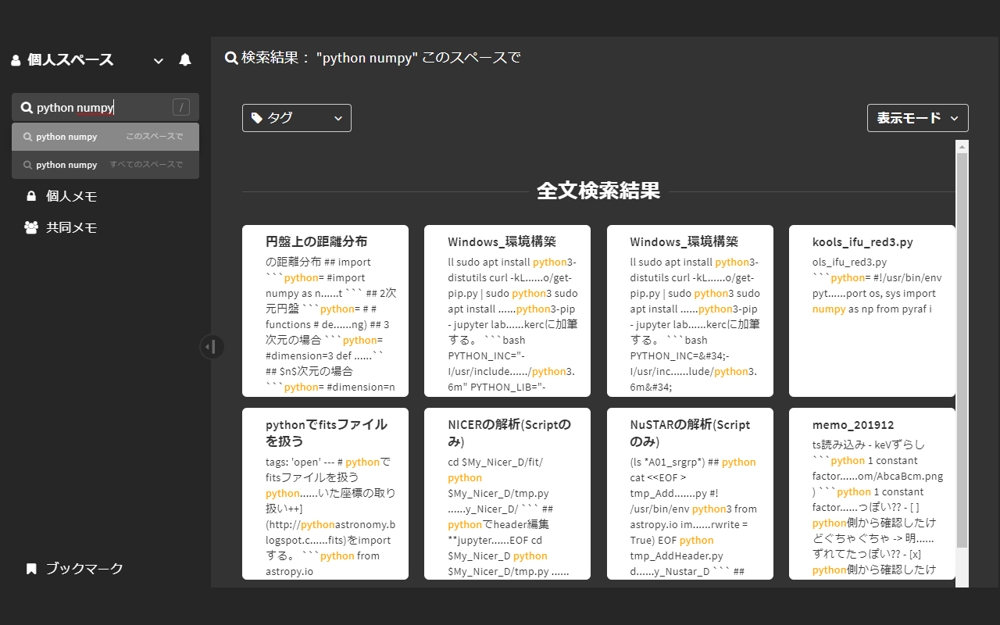
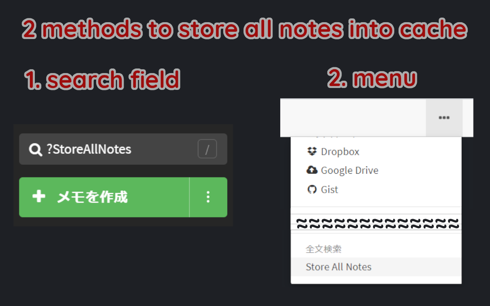
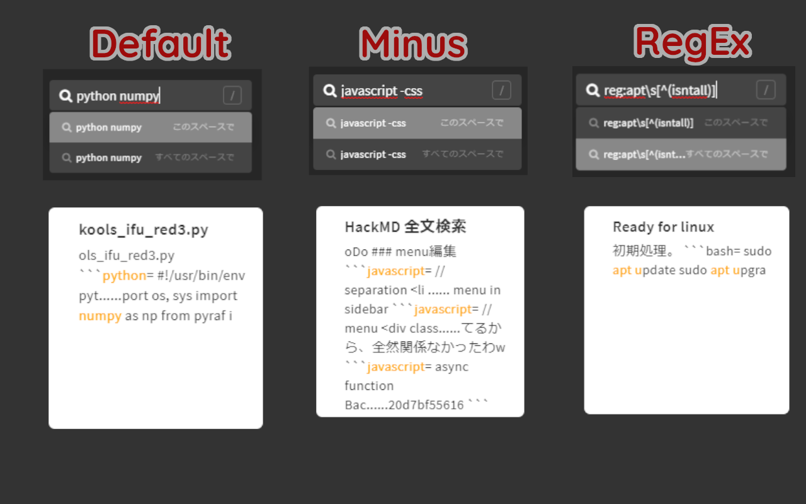
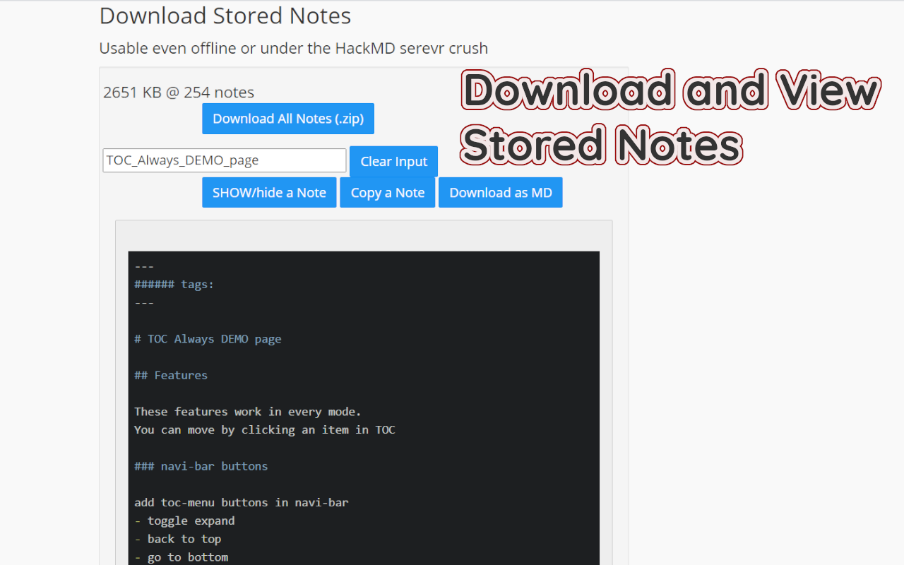

# HackMDsearch

## Abstract

With this extension, you can search from sentences of your notes in HackMD.
To reduce the burden of HackMD server, this extension stores your all notes in Chrome extension cache.
Then **you can view and download the stored notes even offline or under the server crush**.

この拡張機能により、HackMDで未実装の全文検索を行うことができます。
HackMDのサーバーへの負担を軽減するため、この拡張機能は随時ノートの内容を拡張機能のキャッシュとして保存します。
これにより、**オフラインやサーバーダウン時でも保存されたノートを閲覧したり、ダウンロードしたりできます**。

## Usage

### Store All Notes
On initial use, **you must store your all notes to this extension cache**. There are two methods.
- Push `Stote All Notes` in the navi menu
- input `?StoreAllNotes` in the search input field and press Enter,

When you open a note in HackMD, this extension updated the note content in the cache regularly.

はじめて全文検索を利用する場合、**一度すべてのノートをキャッシュに保存する必要があります**。
- ナビメニューのStore All Notesをクリックする。
- 検索画面で ?StoreAllNotes と入力してEnterを押す。
以降は、ノートの内容はキャッシュへ自動的に保存されます。

### Search
Input words in the search input field and press Enter, then the results with the highlighted search words will be shown; they are sorted by updated time.

You can utilize some methods and combine them.

全文検索においてはマイナス検索、フレーズ検索、正規表現検索を利用できます。

|method|input|effect|
|-|-|-|
|default|`words`|splited with space and find notes with all queries|
|minus|-`word`|exclude notes with _minus words_ from the results|
|phrase|"`words`"|words surrounded `"` are not splited even they include spaces|
|RegEx|reg:`regular expression`|you can use regular expression|

### Download and View Stored Notes
On the option page, you can **view and download sotred notes even offline or under the HackMD server crush**.

オプションページにおいて、**オフライン時やHackMDのサーバーダウン時にも、保存されたノートを閲覧・ダウンロードする**ことができます。

## Caution
Again **to reduce the burden of HackMD server, this extension stores your all notes in Chrome extension cache.**
The cache storage may be `10-1000 kBytes per note`.

## LICENSE

MIT
